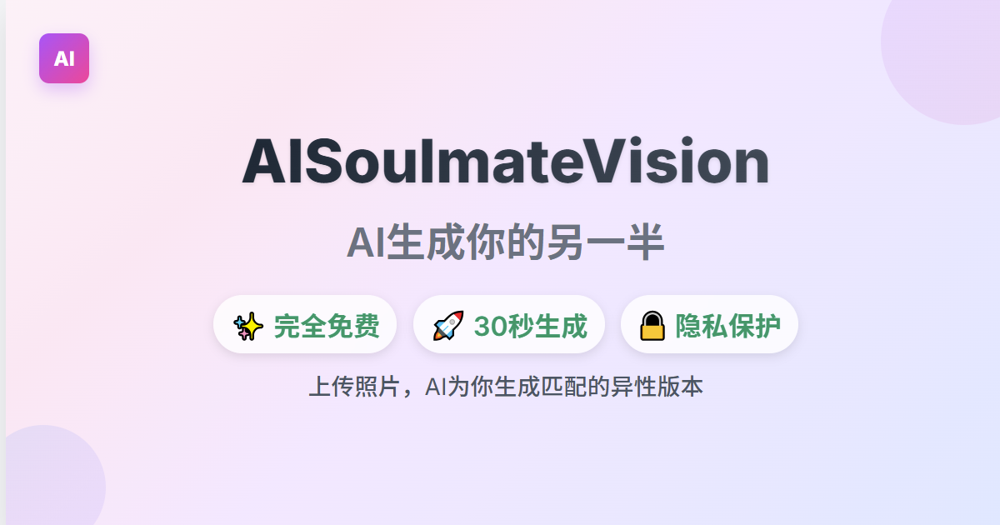

# 🌟 AISoulmateVision

**AI 智能生成你的另一半 | AI-Powered Soulmate Generator**

一个基于人工智能的娱乐性网站，支持全球多语言用户上传照片生成理想另一半。



## 🌍 **多语言支持** 

- 🇨🇳 **中文** (简体)
- 🇺🇸 **English** (英语)
- 🇯🇵 **日本語** (日语)
- 🇰🇷 **한국어** (韩语)

**智能语言检测**: 自动根据用户地理位置、浏览器语言偏好智能切换界面语言

## 📋 **项目概述**

**项目名称**: AISoulmateVision  
**项目类型**: 国际化娱乐性网站  
**核心功能**: 智能分析用户照片特征，AI 生成匹配的异性另一半照片  
**目标用户**: 全球用户 (支持多语言)  
**部署状态**: 生产就绪，可部署到 Vercel

## ✨ **核心功能特性**

### 🎯 **AI 生成能力**
- **智能性别检测**: 自动识别上传照片的性别信息
- **精准特征分析**: 深度学习分析年龄、五官、气质、肤色等特征
- **异性匹配生成**: 基于PhotoMaker模型生成高质量异性另一半
- **现实风格**: 专注于真实感人像生成，避免动漫卡通风格

### 🌐 **多语言系统**
- **智能语言检测**: 
  - 优先级1: 用户历史偏好 (localStorage)
  - 优先级2: 浏览器语言设置检测
  - 优先级3: 时区地理位置推测
  - 优先级4: 默认英文 (国际友好)
- **完整本地化**: 所有UI文本、错误信息、页面内容全面翻译
- **SEO优化**: 支持多语言路由和hreflang标签

### 🎨 **用户体验**
- **拖拽上传**: 支持拖拽和点击上传，最大10MB
- **实时预览**: 上传后即时显示图片预览
- **进度反馈**: 清晰的生成进度和状态提示
- **响应式设计**: 完美支持移动端和桌面端
- **下载分享**: 一键下载合成图片，支持6大社交平台分享

### 🔒 **安全与隐私**
- **数据保护**: 上传照片仅用于AI生成，24小时后自动删除
- **内容安全**: 智能过滤和负面提示词保护
- **使用控制**: 防恶意滥用机制
- **隐私政策**: 完整的多语言隐私保护说明

## 🚀 **快速开始**

### 环境要求
- Node.js 18+ 
- npm 或 yarn
- Replicate API Key (用于AI生成)

### 本地开发

```bash
# 1. 克隆项目
git clone https://github.com/yourusername/ai-soulmate-vision.git
cd ai-soulmate-vision

# 2. 安装依赖
npm install

# 3. 环境变量配置
cp .env.example .env.local

# 配置以下环境变量:
REPLICATE_API_TOKEN=your_replicate_api_token_here
ENABLE_AI_GENERATION=false  # 开发环境建议设为false使用模拟模式

# 4. 启动开发服务器
npm run dev

# 5. 访问应用
# 浏览器打开 http://localhost:3000
```

### 生产部署

#### Vercel 部署 (推荐)
```bash
# 1. 安装Vercel CLI
npm i -g vercel

# 2. 登录Vercel
vercel login

# 3. 部署
vercel

# 4. 配置环境变量
# 在Vercel控制台设置:
# REPLICATE_API_TOKEN=your_production_api_token
# ENABLE_AI_GENERATION=true
```

#### Docker 部署
```bash
# 1. 构建镜像
docker build -t ai-soulmate-vision .

# 2. 运行容器
docker run -p 3000:3000 \
  -e REPLICATE_API_TOKEN=your_token \
  -e ENABLE_AI_GENERATION=true \
  ai-soulmate-vision
```

## 🛠️ **技术栈**

### 前端框架
- **Next.js 14**: 最新的React全栈框架
- **TypeScript**: 类型安全的JavaScript
- **Tailwind CSS**: 实用优先的CSS框架
- **React Hooks**: 现代状态管理

### AI集成
- **Replicate API**: 云端AI模型调用
- **PhotoMaker模型**: 专业人脸生成技术
- **智能Prompt工程**: 动态优化生成提示词

### 多语言国际化
- **自定义i18n系统**: 轻量级多语言解决方案
- **智能语言检测**: 浏览器+地理位置检测
- **SEO友好路由**: `/en/`, `/ja/`, `/ko/` 多语言路径

### 部署与监控
- **Vercel**: 无服务器部署平台
- **Vercel Analytics**: 用户行为分析
- **环境变量管理**: 安全的配置管理

## 📁 **项目结构**

```
ai-soulmate-vision/
├── src/
│   ├── app/                    # Next.js App Router
│   │   ├── [locale]/          # 多语言路由
│   │   │   ├── about/         # 关于页面
│   │   │   ├── privacy/       # 隐私政策
│   │   │   └── terms/         # 服务条款
│   │   ├── api/               # API路由
│   │   │   └── generate/      # AI生成接口
│   │   └── globals.css        # 全局样式
│   ├── components/            # React组件
│   │   ├── Hero.tsx          # 主页英雄区
│   │   ├── UploadSection.tsx # 上传功能组件
│   │   ├── LanguageSwitcher.tsx # 语言切换器
│   │   └── ...               # 其他组件
│   ├── contexts/             # React上下文
│   │   └── LanguageContext.tsx # 多语言上下文
│   ├── lib/                  # 工具库
│   │   ├── translations.ts   # 翻译文件
│   │   └── replicate.ts      # AI API封装
│   └── types/                # TypeScript类型定义
├── public/                   # 静态资源
│   ├── favicon.ico          # 网站图标
│   ├── og-image.png         # 社交分享图片
│   └── ...                  # 其他静态文件
├── docs/                    # 文档
│   ├── MULTILINGUAL-STRATEGY.md  # 多语言策略
│   └── API-TROUBLESHOOTING.md    # API故障排除
└── README.md               # 项目说明
```

## 📊 **功能完成度**

### ✅ **已完成功能** (100%)
- [x] **核心AI生成** - PhotoMaker模型集成，智能性别检测
- [x] **多语言系统** - 4语言全覆盖，智能检测切换
- [x] **用户界面** - 现代化设计，完美响应式布局
- [x] **图片处理** - 拖拽上传，格式验证，压缩优化
- [x] **下载分享** - 合成图片下载，6平台社交分享
- [x] **SEO优化** - sitemap，robots.txt，meta标签
- [x] **安全控制** - 防滥用机制，内容过滤
- [x] **完整页面** - About, FAQ, Privacy, Terms多语言页面
- [x] **问卷功能** - 6问题问卷，多语言支持，AI文字描述生成

### 🚧 **规划功能** (待扩展)
- [ ] **用户系统** - 注册登录，历史记录
- [ ] **参数调整** - 风格选择，特征调节
- [ ] **付费订阅** - 高级功能，无限生成
- [ ] **社区功能** - 作品分享，评论互动

## 💰 **成本估算**

### Replicate API成本
- **图片生成**: ~$0.0023 USD/次
- **文字描述生成**: ~$0.003 USD/次 (Llama-2-70B)
- **月1000次图片**: ~$2.3 USD  
- **月1000次文字描述**: ~$3 USD
- **月10000次总成本**: ~$53 USD

### Vercel托管
- **Hobby计划**: 免费 (适合个人项目)
- **Pro计划**: $20/月 (适合商业部署)

## 🌟 **开发亮点**

### 智能AI生成系统
```typescript
// 智能性别检测和Prompt优化
const detectGender = (filename: string): 'male' | 'female' => {
  const maleKeywords = ['boy', 'man', 'male', '男', 'homme', '男性']
  const femaleKeywords = ['girl', 'woman', 'female', '女', 'femme', '女性']
  // ... 智能检测逻辑
}

// 动态生成优化Prompt
const generatePrompt = (gender: string, oppositeGender: string) => {
  return `A realistic portrait photo of a beautiful ${oppositeGender}, 
          matching the age and style of the uploaded ${gender} photo...`
}
```

### 多语言智能检测
```typescript
// 浏览器+地理位置+时区综合检测
function detectUserLanguage(): Language {
  // 1. localStorage用户偏好
  // 2. navigator.languages浏览器设置  
  // 3. Intl.DateTimeFormat时区地理推测
  // 4. 默认英文(国际友好)
}
```

### 响应式组件设计
```typescript
// 移动端优先的响应式设计
<div className="
  grid grid-cols-1 md:grid-cols-2 gap-6
  px-4 md:px-6 lg:px-8
  max-w-7xl mx-auto
">
```

## 📞 **联系方式**

**开发者**: Wang Huitian  
**邮箱**: wanghuitian475@gmail.com  
**项目仓库**: [GitHub](https://github.com/yourusername/ai-soulmate-vision)  

## 📄 **开源协议**

MIT License - 欢迎贡献和分享！

---

### 🌟 **项目特色**
- 🎯 **专业AI技术** - PhotoMaker模型保证生成质量
- 🌍 **全球化支持** - 智能多语言检测，国际用户友好  
- 🚀 **生产就绪** - 完整的安全、SEO、监控配置
- 📱 **移动优先** - 完美的跨设备用户体验
- 🔧 **易于扩展** - 模块化架构，便于添加新功能

*让AI为你找到完美的另一半！ | Let AI find your perfect soulmate!* 